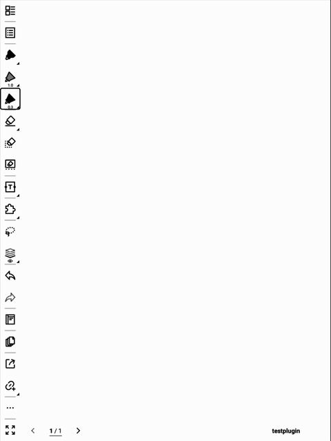

# Scribble

Erase Supernote handwriting the way you do on paper: draw a quick back-and-forth
scribble over the strokes you want gone, lift the pen, and they disappear —
along with the scribble itself. No lasso, no button; it reacts to the gesture.



## Install

1. Download `scribble.snplg` from the
   [latest release](https://github.com/vincentaravantinos/scribble/releases/latest).
2. Copy it to your Supernote (any folder).
3. On the device: **Settings → Plugins → Install plugin →** select
   `scribble.snplg` **→ Install**.

## How to use

- **Erase:** scribble a tight zigzag (several firm back-and-forth passes) over
  the strokes you want to remove, then lift the pen. The crossed strokes and the
  scribble both vanish.
- **Undo:** changed your mind? Tap the device **Undo** button — everything comes
  back.

That's the whole plugin. There's nothing to open or configure.

### Good to know

- **Normal writing is safe.** Detection keys off the back-and-forth motion (many
  direction reversals), so ordinary handwriting — even dense cursive — doesn't
  trigger an erase. If you want to erase, scribble deliberately.
- **It won't run away.** If a scribble would take in far more content than it
  actually crossed, it cancels itself instead of wiping a large area.

## Limitations

- The device can only delete via a rectangular selection, so an erase is bounded
  by the crossed strokes' bounding box — a stroke sitting *fully inside* that box
  can be removed too. It's always reversible with Undo.
- One continuous scribble per gesture (pen-down to pen-up). If you lift mid-way,
  each piece is judged on its own.
- Slower on very dense pages — to find what a scribble crosses, the plugin reads
  the whole page (a cost the Supernote SDK charges per page, not per selection),
  and only when you actually scribble.

## Build from source

```
./buildPlugin.sh
```

Bundles the React Native JS, packages `PluginConfig.json` + assets into a
`.snplg`, and (with a device connected) pushes it via adb. See `AGENT.md` for the
development workflow and `SPEC.md` for the behaviour specification.
